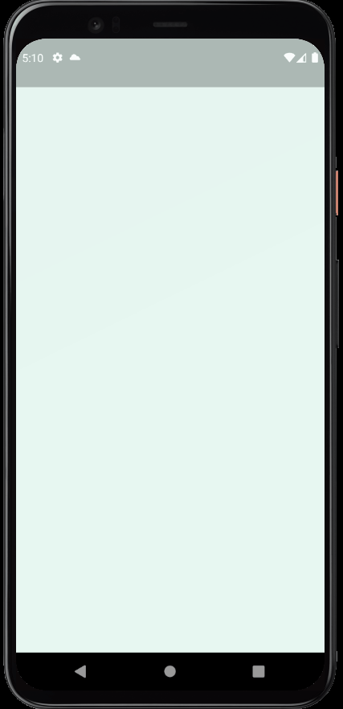

# Split it [NOT FINISHED] - [](https://flutter.dev/)

<h1 align="center">
  
  <p>💵A Flutter App to split the bill between friends💵</p>
  
</h1>

# Features

- Splash page with logo
- Login page using Google Sign in;
- Home page with avatar photo, name, main values to send/receive and historical bills

## Getting Started

- Clone the repository
- run in cmd:
  ```cmd
  flutter pub get
  flutter run
  ```

## Dependencieis

| Lib            | Link                                                        |
| -------------- | ----------------------------------------------------------- |
| Google Fonts   | [google_fonts](https://pub.dev/packages/google_fonts)       |
| Firebase Core  | [firebase_core](https://pub.dev/packages/firebase_core)     |
| Google Sign in | [google_sign_in](https://pub.dev/packages?q=google_sign_in) |
| Mocktail       | [mocktail](https://pub.dev/packages/mocktail)               |

## Device

- Tested in Pixel 4 - Android 11
